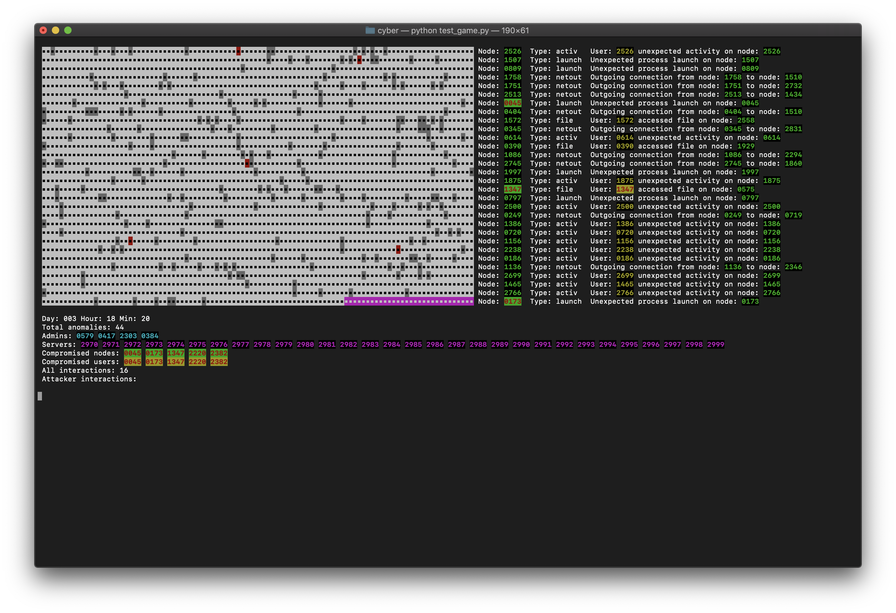

# anomaly_simulation

## Intro
In this repo, you'll find a cyber security distributed anomaly detection simulation. A description of how this simulation works can be found further down in this readme.

## Getting started
1. Clone or download this repo as a zip file. If you downloaded this as a zip, unzip it somewhere.
2. Open a terminal and cd to the directory containing the files you downloaded. Make sure to expand the size of your terminal window, and set the background color to black (e.g. on Mac, open a window using the "Homebrew" profile).
3. Run `python test_game.py`

If everything went well, you should see the following:

## Troubleshooting
- make sure you're using Python 3.x to run this. You might need to specify `python3` at the command-line
- your default Python installation may have not included numpy. To install it, run the following at the command-prompt:
`pip install numpy --user`

## Detailed description
Cyber attacks against company networks can be difficult to detect in an automated fashion due to the fact that attacker actions often blend in with other naturally occurring activities in those environments. Typically an attacker will do extensive reconnaissance and research on a target prior to initiating any actual attack actions. The attacker will then select targets from the company they wish to attack and attempt to compromise their machines via social engineering (trick a user into opening an infected document, or downloadning and installing malware) or via a supply chain (for instance, compromising a piece of software that is then auto-updated on the victim's machine). Once an attacker has control over a machine, they may perform different actions, based on their motives. Criminally-motivated attackers may spread ransomware, attempt to obtain confidential information (emails, trade secrets, employee information, financial information) for blackmail purposes, or use financial systems to transfer funds into their own accounts. More sophisticated attackers (for instance, nation states) may "lay low", gather information over a long period of time, and exfiltrate data for their own use (e.g. industrial espionage or sabotage). The actions that an attacker may perform after initially compromising a machine can include lateral movement (moving to, and compromising other machines on the network), credential theft (gaining other users' login credentials, especially those belonging to admins), installing and running software on machines, and data exfiltration (gathering and copying data out of the network).

In order to understand how we might detect the actions that attackers perform, we have created a simulation. Our environment simulates machines and users on a company network. A series of anomaly detection mechanisms are present on each machine:
- **outgoing network connection** - when a machine on the network makes an ougoing network connection with another machine that it doesn't normally commmunicate with
- **incoming network connection** - when a machine on the network receives an incoming network connection from another machine that it doesn't normally commmunicate with
- **file access** - when a user accesses a file on a machine that they don't normally access
- **process launch** - when a user launches a process they don't usually launch
- **anomalous process creation** - when a process launches another process that it doesn't usually launch (this is often indicative of a user opening an infected document)
- **login** - a user that doesn't usually log into a machine log into it
- **activity** - when a user is active at a time they usually aren't (for instance at night or on the weekend)

Simulated users come in different flavours:
- **scheduled** - a user that typically works at very specific set times
- **morning** - a user that typically starts work early morning and finishes early afternoon
- **evening** - a user that typically starts work late morning and works into the evening
- **workaholic** - a user that starts early and finishes late, and also works weekends
- **sporadic** - a user that works here and there at various times of the day, including on the weekend

Some users are simulated to turn off their computers while not working. Also, machines have a slight chance to become inaccesible for one timestep due to network outage (moving between meetings, rebooting, etc.)

Machines on the network are loosely grouped into roles such as *general, developer, finance, and management*. Some machines are designated as servers, and also include a role assigment. Each non-server machine has a primary user assigned to it. There are also a number of *admins* who login to their own workstations, but who can also log into servers. All machines and users naturally communicate with servers in the *"general"* role. Machines assigned to specific roles (developer, finance, management, etc.) are expected to only communicate with servers of the same role. When anomalies such as outgoing network connection, or file access are generated, they may simulate machines of one role accessing resources or communicating with servers of a different role.

The simulation works by generating random numbers for each anomaly detection model on each machine at every time step (currently set at every ten minutes). Each time an anomaly value is generated, the algorithm has a very small chance of adding some additional noise to that value. If the random number generated exceeds a threshold, an anomaly of that type is generated. Machines that are compromised have a slightly higher chance of adding noise to the generated anomaly value. Noise is also slightly more likely to be added during off-hours (nights, weekends).

Initially, all machines on the network, and all users are uncompromised. Initial compromises are generated randomly by **anomalous process creation** or **process launch** events. An initial compromise always compromises both the machine and the user associated with that machine. Once a machine and user have been compromised, they can go on to compromise other machines via other events such as **outgoing network connection**, and **login**. Servers and admin accounts are high value targets for attackers, so once a "normal" machine has been compromised, lateral movement infection vectors are slightly favoured for admins and servers. The simulation outputs many anomaly events, only a few of which are actual indications of attacker activities. The purpose of this is to simulate a real-world environment, where most "anomalous" activity is benign (we cannot assume that an on-host anomaly detection model would be completely free of false positives). The purpose of this simulation is thus to devise mechanisms running on each host that can utilize the generated anomaly events to detect the presence of an attacker, and their movements within the environment. Or put another way, to figure out which of the anomaly events are actually caused by attack activities, and to construct a timeline of those activities (trace the actions of the attacker as they move from machine to machine, etc.)

## Advanced
Currently the script is hard-coded to simulate 3000 nodes. The `num_agents` variable in `test_game.py` sets this. Note that due to how the simulation displays in the console, if you edit this value, the new value must be divisible by 100.

The attacker's "aggressiveness" is defined by the `compromised_modifier` variable in the `game_space` class. Higher values make it more likely that the attacker will compromise systems. 

You can use this simulation to generate data (without showing the visual output) by running `generate_data.py`. This script will continually run simulations for 2016 steps, with random `comrpomised_modifier` values and write the resulting output to sequentially numbered files under a directory named **saves**. The data is written in json format.
